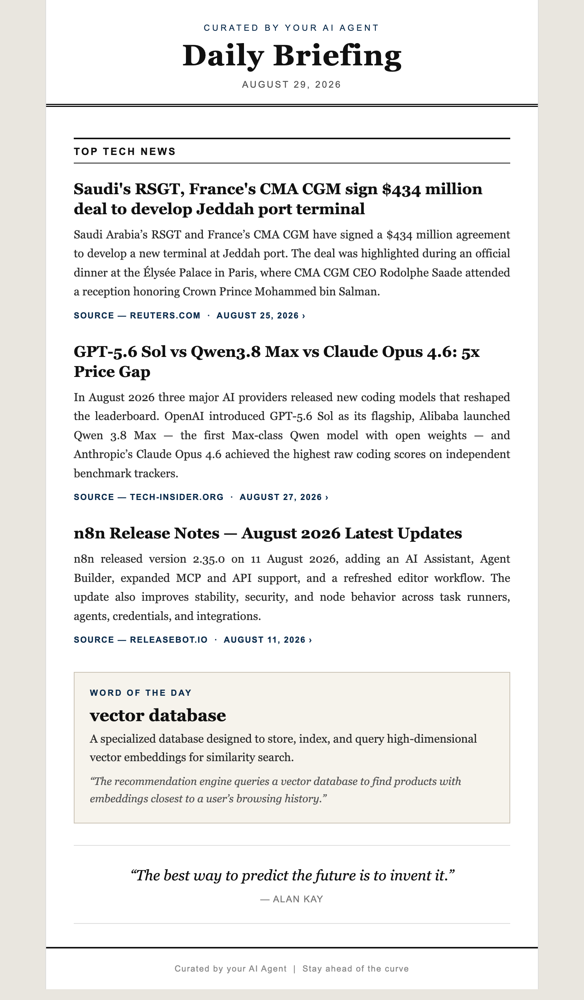
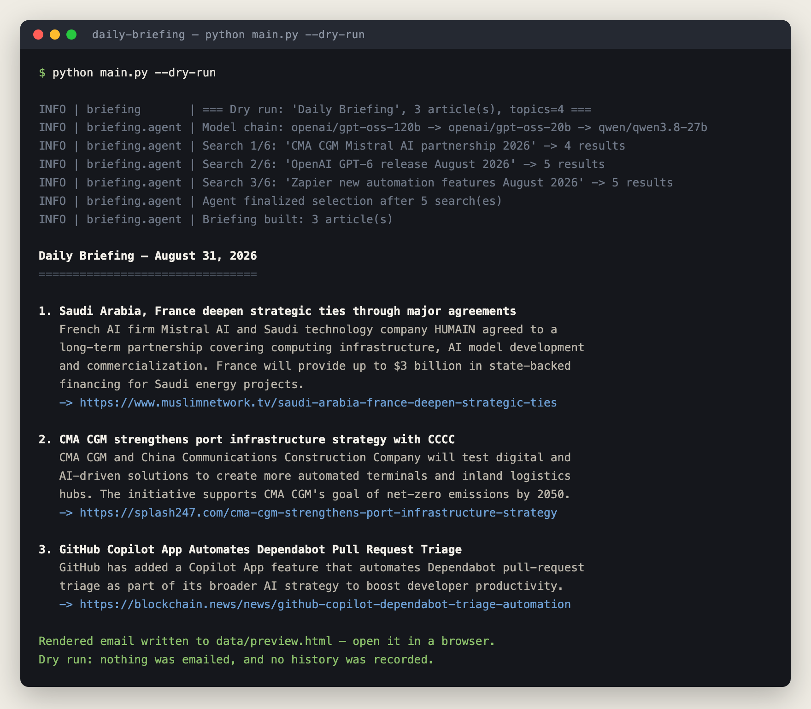
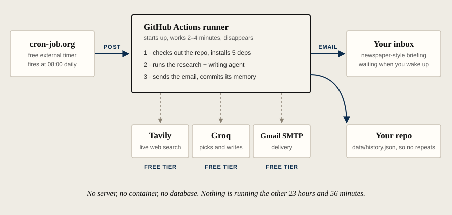

<h1 align="center">Daily Briefing Agent</h1>

<p align="center">
  <strong>Wake up to an AI-written news briefing in your inbox every morning, on the
  topics you choose, written from real freshly-searched articles.<br>100% free, no
  server, runs entirely on GitHub Actions.</strong>
</p>

<p align="center">
  <a href="https://github.com/tballochi/daily-briefing/actions/workflows/ci.yml"></a>
  <a href="LICENSE"></a>
  
</p>

<p align="center">
  
</p>

<p align="center"><em>A real briefing. Every headline, summary and link in it was
chosen and written by the agent.</em></p>

---

It's 8am. Your coffee is still too hot to drink, so you open your inbox, and the only
thing worth reading is already there. Three stories that actually matter to you, four
sentences each, every source linked and dated. Nothing you were sent yesterday. No feed,
no notifications, no twenty tabs you'll never get back to.

While you were asleep, an agent searched the web on your topics, threw out the filler,
read what was left and wrote it up. By the time your coffee is drinkable, you're caught
up, and you close the tab and get on with your day.

---

## Try it in 2 minutes

You need **two free API keys**. No Gmail, no deploy, no account anywhere else.

```bash
git clone https://github.com/tballochi/daily-briefing.git
cd daily-briefing
pip install -r requirements.txt

python main.py --setup      # asks for your keys and checks each one works
python main.py --dry-run    # builds a real briefing, sends nothing
```

Both keys are free: [Groq](https://console.groq.com/keys) and
[Tavily](https://app.tavily.com). Prefer not to use the wizard? Put them in a `.env`
file yourself as `GROQ_API_KEY=` and `TAVILY_API_KEY=`.

`--dry-run` researches the news, writes the briefing, prints it to your terminal and
saves the rendered email to `data/preview.html`. **It sends nothing and stores nothing**,
so you can see exactly what you'd be getting before setting up delivery.

<p align="center">
  
</p>

Then edit `config.yaml` to your own topics and run it again.

---

## What it actually does

Every morning, an autonomous agent:

1. **Researches.** Runs live web searches across *your* topics, judges the results, and
   skips anything it already sent you on a previous day.
2. **Writes.** Summarises the chosen stories from their real source text. No
   hallucinated facts, no fabricated links: every URL comes from a real search result.
3. **Delivers.** Emails you a newspaper-style digest, at the time you choose.

It's a tool-using agent, not a fixed script: it decides what to search, judges what's
worth keeping, and searches again if the results are thin.

<p align="center">
  
</p>

**In the email:** your N top stories, each with a factual summary, source and publication
date · a word of the day · a quote of the day. Optionally, one slot is reserved for a
**focus theme** you never want to miss.

---

## Make it yours: `config.yaml`

One readable file, no code, no secrets:

```yaml
title: Daily Briefing        # shown in the email subject + header
num_articles: 3              # how many stories per morning

topics:                      # what the agent researches (free text)
  - AI & LLMs (GPT, Claude, agents, MCP)
  - automation & no-code (n8n, Zapier, Make)
  - dev tools & open source

focus:                       # OPTIONAL: a story that's ALWAYS included
  label: shipping / maritime / logistics
  priority_query: CMA CGM    # searched first; preferred when there's fresh news
  keywords: [cma cgm, shipping, maritime, container, freight]

model: openai/gpt-oss-120b   # the Groq model the agent thinks with
model_fallbacks:             # tried in order if the one above is retired
  - openai/gpt-oss-20b
  - qwen/qwen3.8-27b
```

Topics are free text, so point it at finance, climate, football, your industry, whatever
you want to wake up informed about. Don't want a guaranteed story? Delete the `focus:`
block. No `config.yaml` at all? Sensible defaults keep it running.

---

## Deploy free on GitHub Actions

Nothing stays on. No server, no container, no cron on your laptop.

**1.** Click **[Use this template](https://github.com/tballochi/daily-briefing/generate)**
to get your own copy (or fork it). Then clone it and run:

```bash
python main.py --setup
```

The wizard asks for each key, **verifies it against the real API before saving**, so a wrong
Gmail App Password fails here instead of silently at 8am tomorrow. It clears the inherited
de-duplication history, offers to upload your secrets with the `gh` CLI, and prints your
pinger URL with your repo already filled in.

**2.** Add 5 **Settings → Secrets and variables → Actions** secrets (the wizard can do
this for you if you have the `gh` CLI):

| Secret | Where to get it |
|--------|-----------------|
| `GROQ_API_KEY` | [console.groq.com/keys](https://console.groq.com/keys), free |
| `TAVILY_API_KEY` | [app.tavily.com](https://app.tavily.com), free, 1000 searches/month |
| `GMAIL_ADDRESS` | the Gmail that sends the briefing |
| `GMAIL_APP_PASSWORD` | [16-char App Password](https://myaccount.google.com/apppasswords) (needs 2FA). **Not** your Gmail password |
| `RECIPIENT_EMAIL` | where it gets delivered |

**3.** Test it now: **Actions → Daily Briefing → Run workflow**, tick `force`.

**4.** Make it punctual by adding a free external pinger (5 minutes, one time):

<details>
<summary><strong>Why, and how to set up the free cron pinger</strong></summary>

<br>

GitHub's own `schedule:` cron is unreliable on low-activity repos: it drops most
triggers and can fire hours late, so "before 10am" isn't guaranteed by it alone. The fix,
still 100% free, is a tiny external cron that calls GitHub at a fixed time. GitHub's own
cron stays on as a best-effort backup.

**a) Create a GitHub token** at [new fine-grained token](https://github.com/settings/personal-access-tokens/new)
- Repository access: *Only select repositories* → this repo
- Permissions → **Actions: Read and write**
- Copy the `github_pat_...` value

**b) Create a free job on [cron-job.org](https://cron-job.org)**, daily at ~08:00 in your
timezone:

- **Method**: `POST`
- **URL**: `https://api.github.com/repos/<you>/daily-briefing/actions/workflows/daily-briefing.yml/dispatches`
- **Body**: `{"ref":"main"}`
- **Headers**:
  - `Accept: application/vnd.github+json`
  - `Authorization: Bearer <your github_pat_...>`
  - `X-GitHub-Api-Version: 2022-11-28`

A successful call returns **HTTP 204**. The pinger fires *without* forcing, so it still
passes the morning-window and once-a-day guards, so it can never double-send.

> Renamed the repo later? Update the URL by hand; GitHub redirects GETs but not
> reliably POSTs.

</details>

---

## Design choices

The things this does differently, and what they cost:

| | |
|---|---|
| **No paid step, anywhere** | It runs inside the Groq, Tavily and GitHub Actions free tiers. A daily run uses ~180 of Tavily's 1000 monthly searches. Worth being clear: those are three companies' free tiers, not a guarantee I can make. If one changes, this changes. |
| **No infrastructure** | No server, no Docker, no database, no always-on process. The trade-off is that you're running on GitHub's schedule and inside their limits. |
| **An agent, not an RSS pipeline** | It picks its own search queries, judges result quality, and searches again when results are thin, which also means it's slower and less predictable than a feed reader. |
| **Never repeats a story** | Sent articles are matched by normalised URL *and* headline, kept in `data/history.json` and committed back to the repo. No database to run; the trade-off is a daily commit in your history. |
| **Never double-sends** | A morning-window guard plus a once-a-day guard, so several triggers still produce one email. |
| **Survives model deprecations** | The model is configurable with a fallback chain. This exists because a hardcoded model was retired by the provider and took the agent down for a day. |
| **Grounded summaries** | Written only from real source text, and any URL the model didn't actually find in a search result is dropped before it can reach the email. |
| **Keys stay yours** | They live in your own repo's secrets or your local `.env`. The agent talks to Groq, Tavily and Gmail's SMTP server, and nothing else. |

---

## FAQ

<details>
<summary><strong>What does it cost?</strong></summary><br>

Nothing. A run uses a handful of Groq calls and up to 6 Tavily searches, well inside both
free tiers (Tavily gives 1000 searches/month; the briefing uses ~180). GitHub Actions is
free for public repos. cron-job.org is free. There is no paid tier to graduate into.
</details>

<details>
<summary><strong>Where do my API keys live? Is anything sent to you?</strong></summary><br>

Your keys live in **your** GitHub repo's Actions secrets (or your local `.env`, which is
gitignored). The agent talks only to Groq, Tavily and Gmail's SMTP server. Nothing is
sent anywhere else, and the author never sees your keys, topics or briefings.
</details>

<details>
<summary><strong>How do I change the model?</strong></summary><br>

Edit `model:` in `config.yaml` to any model your Groq key can reach, and list backups
under `model_fallbacks:`. You can also override it without editing the file by setting
the `GROQ_MODEL` environment variable (or a `GROQ_MODEL` GitHub Actions *variable*).
Providers retire models regularly, so check
[Groq's deprecations page](https://console.groq.com/docs/deprecations) for what's live.
</details>

<details>
<summary><strong>Can I use something other than Gmail?</strong></summary><br>

Yes, with a small edit. `email_sender.py` uses plain `smtplib` over SSL, so pointing
`SMTP_HOST` / `SMTP_PORT` at another provider (Fastmail, Zoho, a company relay) and using
that account's credentials works. Gmail is the default only because its App Passwords are
free and easy.
</details>

<details>
<summary><strong>Can I change the delivery time?</strong></summary><br>

Yes. The time is set by your cron-job.org job; the workflow only enforces a
**06:00–11:00 Europe/Paris** safety window so a stray trigger can't email you at night.
To move outside that window, edit the hour list in the gate step of
`.github/workflows/daily-briefing.yml` (and `TIMEZONE` in `scheduler.py` for local runs).
</details>

<details>
<summary><strong>What if it fails one morning?</strong></summary><br>

It retries once after two minutes. If that also fails you get a short "couldn't send
today" email explaining why, the full traceback goes to the Actions log, and the run is
marked failed, so a broken morning is red in the Actions tab rather than a green check.
The next morning's run is unaffected.
</details>

<details>
<summary><strong>Can I get more than 3 stories, or several briefings a day?</strong></summary><br>

Set `num_articles:` to whatever you like. One briefing per day is enforced by design,
because the de-duplication history keys on the date, so a second daily send would need that
guard changed.
</details>

---

## Run it locally instead

```bash
python main.py --setup    # guided setup (or copy .env.example by hand)
python main.py --dry-run  # preview only, sends nothing
python main.py --now      # build & send one briefing now
python main.py            # run the scheduler (daily at 09:00 Europe/Paris)
```

## Tests

```bash
pip install -r requirements-dev.txt
pytest -q
```

Mocked network, no API keys needed, runs in under a second. Covers the model fallback
chain, config defaults, de-duplication and both send guards. CI runs it on every push.

## Tech stack

| Tool | Role |
|------|------|
| Python 3.11+ | Core language. 5 dependencies, no framework |
| Groq (`openai/gpt-oss-120b`) | The agent's brain. Configurable, with fallbacks |
| Tavily | Real-time news search |
| GitHub Actions | Runtime for the daily job |
| cron-job.org | External pinger, so it fires on time |

## Project structure

```
daily-briefing/
├── config.yaml            # your preferences: title, topics, focus, model
├── config.py              # loads/validates config.yaml, checks required secrets
├── main.py                # entry point (--setup / --dry-run / --now)
├── setup_wizard.py        # guided setup, verifies every key
├── agent.py               # the agent: research loop, writing, HTML rendering
├── email_sender.py        # Gmail delivery
├── scheduler.py           # the briefing jobs + local daily scheduler
├── history.py             # remembers sent articles (no repeats)
├── data/history.json      # the de-duplication memory
├── docs/                  # screenshot + sample briefing
├── tests/                 # pytest suite (no network)
└── .github/workflows/     # daily-briefing.yml (the morning run) + ci.yml
```

---

## Contributing

Issues and PRs welcome. See [CONTRIBUTING.md](CONTRIBUTING.md).

## License

MIT. See [LICENSE](LICENSE).

Built by [Timoté Ballochi](https://github.com/tballochi).
